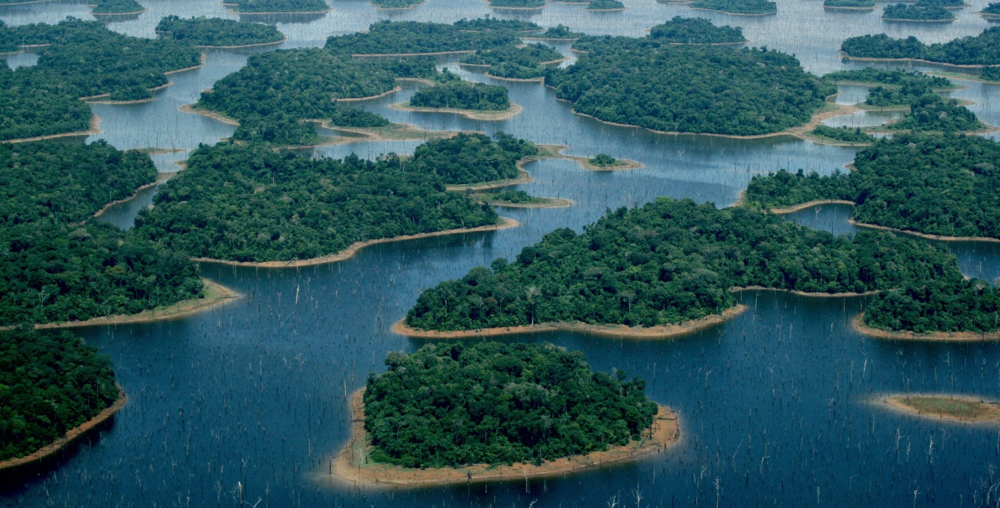

_Esse texto surgiu de uma vontade de escrever sobre o tema central da maior parte da pesquisa que eu desenvolvo hoje: insularização florestal. Aqui, eu saio de ilhas em alto mar para chegar no objeto central desse texto, que são ilhas criadas por reservatórios de usinas hidrelétricas, enquanto também conto um pouco dos meus interesses pessoais. Meu objetivo é abordar o conceito de insularização e o que ela causa sobre a biodiversidade._ 
_Espero que você goste :)_

## O que é uma ilha?
Ilhas estão no nosso imaginário desde os primórdios da biologia, marcados pelas [expedições naturalistas](https://portal.sbpcnet.org.br/noticias/as-expedicoes-naturalistas-no-brasil-no-seculo-xix/) a arquipélagos ao redor do mundo. Um dos primeiros naturalistas que me recordo ter despertado meu interesse foi [Alfred Russel Wallace](https://pt.wikipedia.org/wiki/Alfred_Russel_Wallace), um pesquisador de recursos escassos que a história obscureceu, e que por volta de 1858 em suas explorações no arquipélago malaio, teve [seus primeiros lampejos sobre a seleção natural](https://digitalcommons.wku.edu/cgi/viewcontent.cgi?article=1002&context=dlps_fac_arw).

Alfred também é conhecido como o pai da [biogeografia](https://pt.wikipedia.org/wiki/Biogeografia), o estudo da distribuição das espécies no espaço e no tempo. Se você é um estudante de biologia, ou tem familiaridade com o tema, já deve ter ouvido o termo "biogeografia" em outro contexto e com outros nomes: Robert MacArthur e Edward O. Wilson, que propuseram a [teoria de biogeografia de ilhas](https://ecovirtual.ib.usp.br/doku.php?id=ecovirt:roteiro:neutr:biogeo_base) (MacArthur & Wilson, [1963](https://www.jstor.org/stable/2407089?origin=crossref), [1967](https://www.jstor.org/stable/j.ctt19cc1t2)).

A teoria de biogeografia de ilhas nos diz que o número de espécies em uma ilha é resultado de um balanço entre o número de espécies que chegam na ilha através da imigração e que desaparecem através da extinção local. Para ilhas maiores e para ilhas menos isoladas, esse balanço vai resultar em um maior número de espécies. Já para ilhas menores e para ilhas mais isoladas, vai resultar em um menor número de espécies. MacArthur e Wilson estudaram dados de diferentes ilhas oceânicas, entre elas o arquipélago da [Melanésia](https://pt.wikipedia.org/wiki/Melan%C3%A9sia), e também [Krakatau](https://pt.wikipedia.org/wiki/Krakatoa).

Mais tarde, a teoria de biogeografia de ilhas deixou as ilhas oceânicas e passou a ser aplicada também a outros ecossistemas, entre eles ambientes terrestres ([Diamond, 1975](https://www.sciencedirect.com/science/article/abs/pii/000632077590052X?via%3Dihub)). Isso acabou levando a uma mudança na própria concepção do que poderia ser considerado uma “ilha”.

Desde Wallace e os primórdios da biogeografia, nosso conhecimento sobre ilhas tem se expandido bastante. Hoje sabemos que essas extensões de "terra" cercadas por água podem ter diferentes origens (vulcânica, continental, coralínea) e que, inclusive, esse termo pode abranger ambientes menos óbvios, como lagos, topos de montanha ou pedaços de uma floresta previamente contínua ([Matthews & Triantis, 2021](https://www.cell.com/current-biology/fulltext/S0960-9822(21)00988-X?_returnURL=https%3A%2F%2Flinkinghub.elsevier.com%2Fretrieve%2Fpii%2FS096098222100988X%3Fshowall%3Dtrue)). Nesse contexto, **ilha é um ambiente cercado por outro que é inadequado para a persistência das espécies**. 

00988-X?_returnURL=https%3A%2F%2Flinkinghub.elsevier.com%2Fretrieve%2Fpii%2FS096098222100988X%3Fshowall%3Dtrue) **Diferentes tipos de ilhas**: (A) Ilha do Pico, nos Açores, uma ilha oceânica de origem vulcânica; (B) muitos sistemas do tipo ilha têm sido identificados no ambiente marinho, como os montes submarinos; (C) atóis são ilhas formadas por recifes de corais; (D) fragmentos florestais insulares cercados por áreas agrícolas; (E) ilhas dentro de lagos; e (F) lagos, que podem ser considerados ilhas do ponto de vista de animais aquáticos.](Matthews_Triantis_2021.png){fig-align="left"}

## Ilhas criadas pela inundação da floresta
O processo de criação de ilhas é chamado de insularização. No Brasil ([Fearnside, 2015](https://fmclimaticas.org.br/wp-content/uploads/2015/07/Hidrel%C3%A9tricas-na-Amaz%C3%B4nia-Impactos-ambientais-Sociais..-V.1.pdf)), e principalmente na região tropical do mundo ([Finer & Jenkins, 2012](https://journals.plos.org/plosone/article?id=10.1371/journal.pone.0035126); [Zarfl et al., 2015](https://link.springer.com/article/10.1007/s00027-014-0377-0)), **a criação de usinas hidrelétricas causa a inundação de florestas previamente contínuas e, quando a topografia permite, a formação de ilhas florestais nos antigos topos de morro**. Quando isso acontece, parte da floresta se perde e é dividida em ilhas de diferentes tamanhos, que passam a ser cercadas por um ambiente contrastante: a água.

Esse processo, que leva anos para ser concluído, na verdade, começa muito antes do próprio barramento do rio. Muito é planejado, como a retirada da vegetação e o resgate da fauna, [mas o que efetivamente acontece é diferente](https://rainforestjournalismfund.org/pt-br/stories/novas-hidreletricas-na-amazonia-ignoram-normas-e-causam-estragos-ambientais). Os impactos da construção da usina têm efeitos duradouros e afetam não apenas a fauna e a flora, mas também [populações indígenas e ribeirinhas, com consequências que reverberam por muito tempo após a inundação](https://rainforestjournalismfund.org/pt-br/stories/terra-arrasada-os-atingidos-por-belo-monte). Existem muitas dessas usinas onde a história foi similar. Alguns nomes que me recordo agora são [Balbina](https://amazoniareal.com.br/os-25-anos-da-usina-hidreletrica-de-balbina-parte-i/), [Tucuruí](https://mapadeconflitos.ensp.fiocruz.br/conflito/pa-atingidos-por-barragens-indigenas-quilombolas-e-comunidades-tradicionais-de-tucurui-lutam-por-seus-direitos/) e [Belo Monte](https://amazoniareal.com.br/belo-monte-o-paquiderme-de-energia-parado/). Em Balbina, por exemplo, uma área de mais de 310.000 hectares de floresta foi inundada, criando mais de 3.500 ilhas de diferentes tamanhos ([Benchimol & Peres, 2015](https://besjournals.onlinelibrary.wiley.com/doi/10.1111/1365-2745.12371)).

{fig-align="left"}

## As mudanças ambientais após a insularização e suas consequências sobre a biodiversidade
O tamanho da ilha pode limitar o número de espécies que vivem nela ([Arrhenius, 1921](https://www.jstor.org/stable/2255763?origin=crossref); [MacArthur & Wilson, 1967](https://www.jstor.org/stable/j.ctt19cc1t2)) e também a quantidade de recursos que estão disponíveis para essas espécies. Além disso, ilhas maiores podem oferecer uma maior variedade de ambientes, como [áreas de borda e de interior](https://anotherecoblog.wordpress.com/2023/03/23/efeitos-de-borda-fantasticos-e-como-encontra-los-ou-nao/) ([Banks-Leite et al., 2010](https://nsojournals.onlinelibrary.wiley.com/doi/10.1111/j.1600-0706.2009.18061.x)), e, por isso, abrigar mais espécies. Elas também tendem a sustentar populações maiores, o que reduz o risco de extinção local. Em ilhas pequenas, por outro lado, as populações costumam ser menores e mais vulneráveis ao desaparecimento ([Aurélio-Silva et al., 2016](https://doi.org/10.1016/j.biocon.2016.03.016)).

[Em comparação com pedaços de floresta de tamanho semelhante cercados por ambientes terrestres, ilhas pequenas cercadas por água abrigam menos espécies de aves](https://theconversation.com/pequenos-fragmentos-florestais-podem-conservar-mais-aves-quando-o-entorno-e-favoravel-283861), por exemplo. Isso ocorre porque as aves que vivem em fragmentos florestais cercados por ambientes terrestres podem usar esse ambiente para se movimentar e seus recursos, como insetos e néctar de flores, o que geralmente não ocorre quando ambiente adjacente é aquático ([Bueno et al., 2026](https://www.pnas.org/doi/10.1073/pnas.2521783123)).

Com a criação de ilhas florestais, as condições ambientais são alteradas. Por exemplo, a quantidade de luz que penetra no interior da ilha e a intensidade do vento aumentam, enquanto a umidade do ar e do solo diminuem ([Laurance et al., 2002](https://conbio.onlinelibrary.wiley.com/doi/10.1046/j.1523-1739.2002.01025.x)). Algumas espécies não conseguem tolerar essas novas condições e desaparecem rapidamente, enquanto outras persistem por algum tempo antes de também desaparecerem ([Kuussaari et al., 2009](https://www.cell.com/trends/ecology-evolution/abstract/S0169-5347(09)00191-8?_returnURL=https%3A%2F%2Flinkinghub.elsevier.com%2Fretrieve%2Fpii%2FS0169534709001918%3Fshowall%3Dtrue)). Na região da Usina Hidrelétrica de Balbina, por exemplo, [mamíferos, aves e tartarugas continuaram desaparecendo das ilhas mesmo 26 anos após o isolamento](https://www.eurekalert.org/news-releases/886933).

Esse atraso nas extinções locais após a insularização florestal é conhecido como débito de extinção ([Kuussaari et al., 2009](https://www.cell.com/trends/ecology-evolution/abstract/S0169-5347(09)00191-8?_returnURL=https%3A%2F%2Flinkinghub.elsevier.com%2Fretrieve%2Fpii%2FS0169534709001918%3Fshowall%3Dtrue); [Jones et al., 2016](https://www.sciencedirect.com/science/article/abs/pii/S0006320716301732?via%3Dihub)), onde a ilha perde espécies até atingir um novo equilíbrio em uma comunidade com menos espécies. 

O débito de extinção também é influenciado pela área das ilhas, onde ilhas menores vão perder espécies mais rapidamente e, portanto, pagar o débito de extinção também mais rapidamente do que ilhas maiores ([Gibson et al., 2013](https://www.science.org/doi/10.1126/science.1240495); [Jones et al., 2016](https://www.sciencedirect.com/science/article/abs/pii/S0006320716301732?via%3Dihub)). Ilhas maiores, por outro lado, vão  atuar como refúgios temporários, permitindo que algumas espécies sobrevivam em um tempo emprestado de vida, atrasando suas extinções locais ([Uezu & Metzger, 2016](https://journals.plos.org/plosone/article?id=10.1371/journal.pone.0147909)). Por esse motivo, as populações dessas espécies podem ser chamadas de “mortas-vivas”.

## O que podemos levar deste texto?
Com esse texto, espero ter esclarecido como a criação de usinas hidrelétricas impacta a biodiversidade mesmo décadas após o barramento do rio. O texto pode ser um pouco desanimador, especialmente quando a gente considera o potencial hidrelétrico previsto para ser explorado na Amazônia... mas nem tudo está perdido (votem em candidatas e candidatos que levam a sério a pauta ambiental na eleição que teremos em quatro dias!). 

Ilhas cercadas por uma matriz aquática representam o pior cenário da insularização, e suas consequências realmente são drásticas. Assim, entender os impactos imediatos e ao longo do tempo que as usinas hidrelétricas causam na floresta pode orientar a tomada de decisões visando a conservação da biodiversidade. O próprio débito de extinção pode ser freado se houver medidas de conservação, como restauração do habitat e gestão da paisagem ([Lira et al., 2012](https://besjournals.onlinelibrary.wiley.com/doi/10.1111/j.1365-2664.2012.02214.x)).

Quase dois séculos depois de Wallace explorar o arquipélago malaio e começar a entender a seleção natural, as ilhas continuam sendo laboratórios naturais. Se antes elas nos ajudaram a compreender como as espécies surgem, agora também nos ajudam a entender como as perdemos.

*Créditos da imagem na capa do post: 
[André Dib](https://www.nationalgeographicbrasil.com/fotografo/andre-dib)*