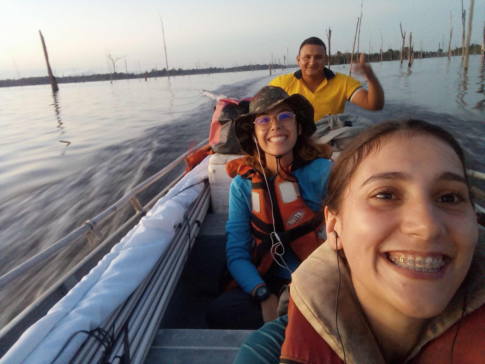

_Hoje quero compartilhar um pouco sobre um artigo que acabamos de publicar na [Royal Society Open Science](https://royalsocietypublishing.org/rsos), liderado pela Rayssa Tormes do Amarante, minha amiga e parceira de pesquisa. Essa publicação é resultado de um trabalho colaborativo que buscou entender o que acontece com as comunidades de aves quando uma floresta contínua é transformada em um conjunto de ilhas. Neste post, quero contar um pouco sobre o estudo, nossas aventuras, os principais resultados que encontramos e o que eles podem nos dizer sobre os efeitos dessa transformação ambiental sobre a biodiversidade._

São quatro horas da tarde e estamos na voadeira, depois de um dia intenso de trabalho de campo. Estivemos amostrando aves de sub-bosque desde as seis da manhã. Rayssa está sentada na minha frente e Maciel pilota o barco enquanto atravessamos o reservatório da Usina Hidrelétrica de Balbina. É difícil imaginar que, antes de 1987, toda essa paisagem era uma floresta contínua. Hoje, as ilhas que vemos são os antigos topos de morros dessa floresta, cercados por uma matriz de água pontilhada de árvores mortas. Esse processo de transformação da floresta contínua em ilhas florestais é chamado de insularização florestal.

{fig-align="left" class="uniform-img"}

Quando a floresta foi inundada, ilhas de diferentes tamanhos e graus de isolamento foram criadas. Em comparação à floresta contínua, ilhas tão pequenas quanto um campo de futebol têm menos habitat disponível e estão mais expostas aos chamados efeitos de borda, que são alterações ambientais como o aumento da temperatura e da incidência de luz. Já o isolamento, causado pela água ao redor das ilhas, dificulta a chegada de aves que dependem da floresta, reduzindo a movimentação de indivíduos entre as ilhas.  

As mudanças no ambiente causadas pela criação das ilhas podem levar não só à perda de espécies, mas também à perda de funções ecológicas que essas espécies desempenham nas ilhas. Quando um grupo de espécies utiliza recursos similares e pode desempenhar funções ecológicas parecidas, esse grupo é chamado de guilda. Por exemplo, algumas aves que se alimentam de frutos, que é o recurso, podem dispersar sementes, que é a função ecológica. 

.](Turdus_albicollis_Beco-do-Catitu_2023-10-27_L4.jpg){fig-align="left" class="uniform-img"}

Quando uma guilda desaparece de uma ilha, perdemos as funções ecológicas que aquele grupo de espécies desempenhava, e não apenas as espécies que faziam parte da guilda. Como consequência, as comunidades de aves nas ilhas se tornam cada vez mais diferentes das encontradas nas florestas contínuas. 

Essas diferenças podem ocorrer principalmente de duas formas: pela substituição de espécies ou por diferenças no número de espécies. A substituição acontece quando espécies presentes em um local são substituídas por outras, enquanto as diferenças no número de espécies ocorrem quando um local apresenta mais ou menos espécies do que outro. 

{fig-align="left"}

É nesse contexto que buscamos entender como a insularização florestal afeta as comunidades de aves de sub-bosque, avaliando como o tamanho e o isolamento das ilhas influenciam as diferenças na composição de espécies e nas funções ecológicas desempenhadas por elas. Também investigamos se essas diferenças são causadas pela substituição de espécies ou por diferenças no número de espécies entre os locais.

Para investigar essas questões, amostramos aves em 32 ilhas e em cinco áreas de floresta contínua no reservatório da Usina Hidrelétrica de Balbina, no Amazonas, entre junho e dezembro de 2023 e 2024. Ao todo, capturamos 1.634 indivíduos pertencentes a 114 espécies de aves. Essas espécies desempenhavam diferentes funções ecológicas, distribuídas em 32 guildas. 

Quando comparamos as comunidades, encontramos que as comunidades das ilhas eram mais diferentes entre si do que as comunidades da floresta contínua. Nas áreas de floresta contínua, a maior parte da diferença entre comunidades foi causada pela substituição de espécies. Ou seja, diferentes locais apresentavam diferentes conjuntos de espécies, mas um número similar de espécies. Nas ilhas, por outro lado, as diferenças foram causadas pelo número de espécies, indicando que algumas ilhas tinham mais espécies do que outras.

As funções ecológicas também diferiram mais entre as ilhas do que na floresta contínua. Nesse caso, as diferenças foram determinadas principalmente pelo número de guildas, indicando que algumas ilhas abrigavam um conjunto maior de funções ecológicas do que outras. Além disso, quanto maiores eram as diferenças de tamanho e de isolamento entre duas ilhas, maiores também eram as diferenças entre suas comunidades. 

No fim, o que esse conjunto de ilhas nos mostra é que os efeitos da insularização podem ir além da perda de espécies. O tamanho e o isolamento das ilhas funcionam como filtros que influenciam quais espécies conseguem permanecer nesses fragmentos e, consequentemente, quais funções ecológicas continuam sendo desempenhadas.

Ao longo do tempo, esse processo pode produzir comunidades cada vez mais diferentes entre si e com um menor número de funções ecológicas. Assim, transformar uma floresta contínua em um conjunto de ilhas não significa apenas reduzir a quantidade de habitat disponível, significa também reorganizar as comunidades que vivem ali e potencialmente modificar o funcionamento desses ecossistemas.

Então, respondendo à pergunta do título **"o que acontece com as aves quando uma floresta contínua vira um conjunto de ilhas?"**, quando uma floresta contínua vira um conjunto de ilhas, as comunidades de aves mudam. Com isso, algumas espécies desaparecem ou deixam de chegar às ilhas, fazendo com que elas tenham diferentes números de espécies e de funções ecológicas. Assim, as comunidades de aves das ilhas ficam mais diferentes entre si e daquelas encontradas na floresta contínua.

O artigo completo pode ser encontrado em [https://royalsocietypublishing.org/rsos/article/13/8/rsos260165/482732/Habitat-insularization-alters-taxonomic-and](https://royalsocietypublishing.org/rsos/article/13/8/rsos260165/482732/Habitat-insularization-alters-taxonomic-and)

Se você gostou desse post e se interessa por ecologia e conservação da biodiversidade, deixo aqui uma sugestão de leitura: 

- [Um naturalista no Antropoceno, do professor Mauro Galetti](https://books.scielo.org/id/p5cwn).

Nesse livro, o autor nos convida a pensar sobre as mudanças na natureza a partir de experiências de campo e reflexões sobre a biodiversidade no Antropoceno.

*Créditos da imagem na capa do post: [Luciane Moral](https://oeldoradoeaqui.blogspot.com/2010/12/lago-de-balbina-presidente-figueiredo.html)*

*Créditos das silhuetas de aves usadas na figura esquemática: [Phylopic](https://www.phylopic.org/nodes/667b8664-5dd7-487e-ba56-c6c5c95055a2/aves-silhouettes)*
